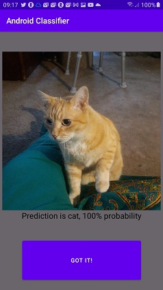

# Pet Classifier
First attempt to deploy an image classifier on Android device

### Update!

 

Now integrated a model trained on the Oxford Pet data set (https://www.robots.ox.ac.uk/~vgg/data/pets/), to discern breeds of cats and dogs. A little more interesting perhaps.

All it took was to point to the new tflite model and the corresponding text file containing the labels. There are 37 labels identifying varieties of cats and dogs.

```
class Classifier(assetManager: AssetManager) {
    //...
    private val modelPath: String = "OxfordPets.tflite"
    private val labelPath: String = "oxford_labels.txt"
```

This project is to go through the basic process from building an image classifier using transfer learning, convert the trained model to Tensorflow Lite format, and then deploy the model for inference on a mobile device. While it at present serves the lofty purpose of distinguishing between cats and dogs (possibly of use for aliens not familiar with our habit of keeping pets), it is intended as a prototype for developing image classification apps. For me this is a learning process, also, in building an Android application in Kotlin, on Android Studio. This entailed using the CameraX API, obtain permissions to use the device's camera, and to preview and capture an image for use in inferences by the model.

Looking at a couple of examples of real time inference using the devices camera, they made predictions asynchronously/continuously. This is not what I wanted. My preference instead is to get a subject in the camera frame, and touch a button to make an inference on that image. So to accomplish this I used the image capture use case with CameraX instead of the analyze use case. I capture an image into a buffer, preprocess the captured image (scaling, reformatting bitmap to expected 3d array of pixel values, and normalizing), and run it through the classifier.

 

Initially, the app is in preview mode. Get what you want to classify and touch the "WHAT AM I?" button to perform inference. The app will then be in a static image mode displaying the captured image and the prediction from the model. Touch "GOT IT!" to dismiss the current capture and resume to preview mode. Note: images are not stored on the device.

To use perhaps a more useful model (i.e., do more than classifying everything as either a cat or a dog), one should simply be able replace the tflite model file and the accompanying text file containing the labels in the assets directory, and (at this point) modify two lines in the Classifier class (classifier.kt) definition as necessary.

```
class Classifier(assetManager: AssetManager) {
    //...
    private val modelPath: String = "CatsVsDogs.tflite"
    private val labelPath: String = "label.txt"
```

The base model used here is mobilenet_v2 (from the Tensorflow Hub), module handle https://tfhub.dev/google/tf2-preview/{}/feature_vector/4, and assumes image input shape of 224 x 224, scaled pixel values to 0 to 1.

